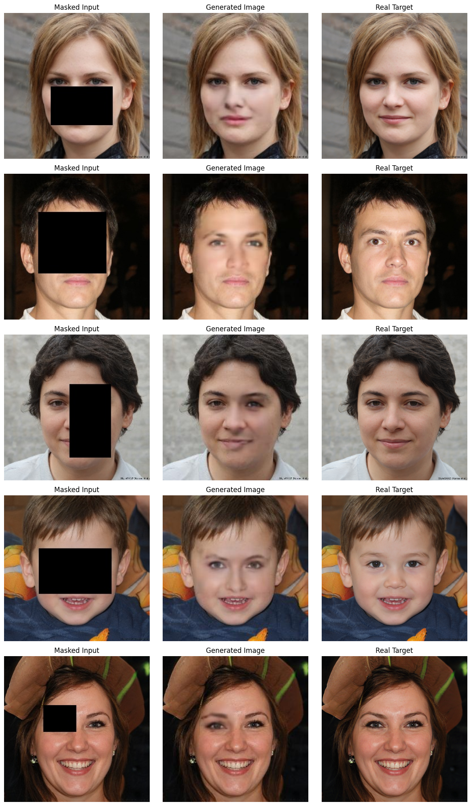

# Face Completion with GAN

AI-powered web application that automatically completes partially masked faces using GANs. Upload a photo and the model will intelligently fill in masked regions of the face.


## Results

**Demo Video**: [Watch the application in action](https://youtu.be/HLUZ7pDtJR0)



## Requirements

- Python 3.12+
- TensorFlow/Keras, Flask, OpenCV, Pillow, NumPy
- See `requirements.txt` for full list

---

## Installation

```bash
# Clone repository
git clone https://github.com/yourusername/gan-face-completion.git
cd gan-face-completion

# Create virtual environment
python -m venv venv
venv\Scripts\activate  # Windows
# source venv/bin/activate  # macOS/Linux

# Install dependencies
pip install -r requirements.txt
```

**Note**: Add the pre-trained model `model_294400.h5` to the project root directory.

## Quick Start

```bash
python app.py
```

Open `http://localhost:5000` in your browser.

1. Upload a face image
2. Click "Load and Complete"
3. View results (original, masked, and completed)
4. Click "Re-mask and Complete" for new variations

## Project Structure

```
├── app.py                    # Flask application
├── templates/index.html      # Web interface
├── static/                   # Generated images
├── traingan.ipynb            # Model training notebook
├── requirements.txt          # Dependencies
└── model_294400.h5          # Pre-trained model
```

## How It Works

1. **Face Detection** - OpenCV detects faces and resizes to 256×256
2. **Random Masking** - Creates random masks on detected faces
3. **GAN Processing** - Model completes masked regions
4. **Result** - Returns original, masked, and completed images

## Tech Stack

- **Backend**: Flask, Python 3.12
- **ML**: TensorFlow/Keras (GAN)
- **Image Processing**: OpenCV, Pillow

## License

MIT License - See LICENSE file for details
